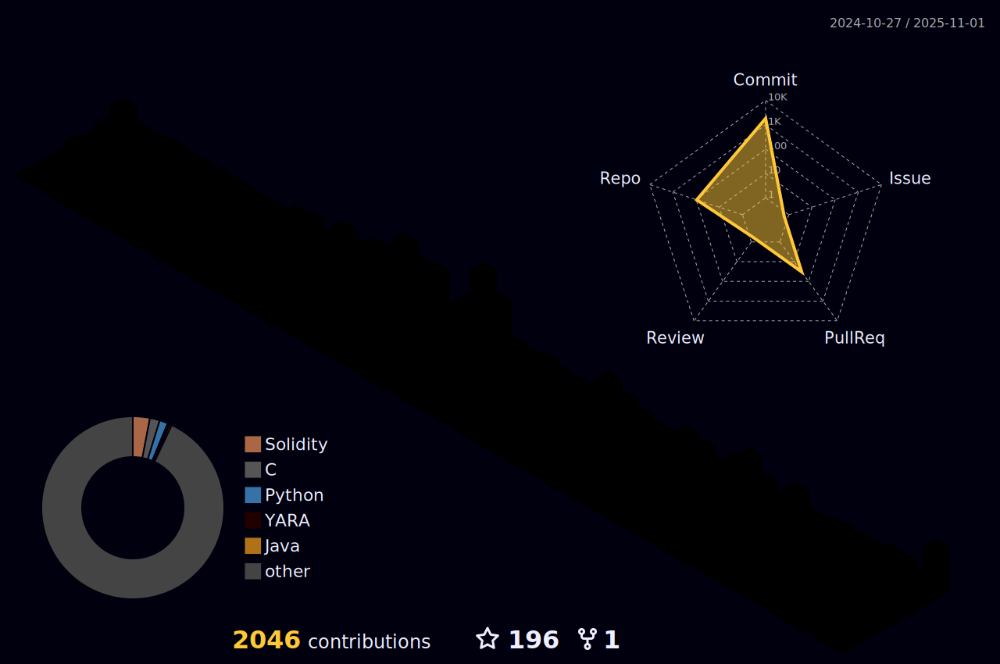

 

 <h2> 💫 HaruAventure is White Hacker & Security Researcher & Security Consultant. 💫 </h2>
 

 

## 제가 공부하는 분야는 아래와 같습니다. 
[

- 화이트 해커 / 모의해킹 전문가 / 정보보안 컨설턴트 / 보안 취약점 연구가 / 보안 개발자 / 풀스택 개발자 / 블록체인 개발자로 나아가는 Dreamer.
  - 최대한 많은 Web2 / Web3 해킹 분야 및 개발 분야를 끊임없이 배우고 접하려고 노력하고 있습니다.

### Webhacking, Smart Contract Hacking, Defi Hacking, Red Team (Black-Box Pentestration Testing), Server Infra Security, OSINT, Pentesting, Cryptography, Web Secure Coding, Web Fuzzing Tool Development, Web3 Secure Coding, Web3 Fuzzing Tool Development, Defi Secure Coding, Defi Fuzzing Tool Development, Front-end Development, Back-end Development, Smart Contract Development,... 

## 🛠 Server Skills

![arista](https://img.shields.io/badge/-Arista-16325B?logo=data:image/svg+xml;base64,PHN2ZyB3aWR0aD0iMTExMyIgaGVpZ2h0PSIxNzUiIHZpZXdCb3g9IjAgMCAxMTEzIDE3NSIgZmlsbD0ibm9uZSIgeG1sbnM9Imh0dHA6Ly93d3cudzMub3JnLzIwMDAvc3ZnIj4KPHBhdGggZD0iTTM5MC4wMjcgMTAzLjQyNkM0MjcuMDIxIDEwMy40MjYgNDQ1LjUxOCA3Ny43MzggNDQ1LjUxOCA1Mi4wNDhDNDQ1LjUxOCAyNi4zNiA0MjcuMDIgMS42OTUwMiAzODcuOTcyIDEuNjk1MDJDMzU5LjE5OSAwLjY2NjAxNiAyNTMuMzU1IDAuNjY2MDE2IDI1My4zNTUgMC42NjYwMTZWMTc0LjMzNEgyODYuMjM0VjI4LjQxM0MzMTEuOTI1IDI4LjQxMyAzNzYuNjY0IDI4LjQxMyAzOTAuMDI0IDI4LjQxM0M0MDguNTIgMjguNDEzIDQxNy43NjkgMzQuNTc2IDQxNy43NjkgNTIuMDQ4QzQxNy43NjkgNjYuNDMzIDQwOC41MjIgNzQuNjU0IDM5MS4wNTEgNzQuNjU0SDMwNC43MzZMNDA3LjQ5NyAxNzMuMzAySDQ0Ny41NzVMMzczLjU4NCAxMDEuMzdDMzgwLjc4IDEwMy40MjYgMzg5IDEwMy40MjYgMzkwLjAyNyAxMDMuNDI2WiIgZmlsbD0id2hpdGUiLz4KPHBhdGggZD0iTTUxMS4yODYgMC42NjkwNjdINDc5LjQzVjE3NC4zMzRINTExLjI4NlYwLjY2OTA2N1oiIGZpbGw9IndoaXRlIi8+CjxwYXRoIGQ9Ik05MTUuMTM3IDI3LjM4NzFWMC42NjkwNjdIODQ3LjMxM0g4MTUuNDU3SDc1OC45MzhMNzQwLjQ0MSAyNy4zODcxSDgxNS40NTdWMTc0LjMzNEg4NDcuMzEzVjI3LjM4NzFIOTE1LjEzN1oiIGZpbGw9IndoaXRlIi8+CjxwYXRoIGQ9Ik02NzcuNzU3IDcyLjYwMDFDNjYxLjMxNiA3Mi42MDAxIDYyMC4yMTQgNzIuNjAwMSA1OTYuNTc1IDcyLjYwMDFDNTgwLjEzNyA3Mi42MDAxIDU3MC44ODYgNjUuNDA4MSA1NzAuODg2IDUxLjAyMDFDNTcwLjg4NiAzNC41ODAxIDU4Mi4xOTEgMjcuMzg3MSA1OTYuNTc1IDI3LjM4NzFDNjE5LjE4NCAyNy4zODcxIDcwNy41NTUgMjcuMzg3MSA3MDcuNTU1IDI3LjM4NzFMNzIxLjk0MiAwLjY2OTA2N0M3MjEuOTQyIDAuNjY5MDY3IDYxNC4wNDQgMC42NjkwNjcgNTk1LjU0NyAwLjY2OTA2N0M1NjYuNzcyIDAuNjY5MDY3IDU0My4xNCAyMi4yNDYxIDU0My4xNCA1Mi4wNTExQzU0My4xNCA3OC43NjYxIDU2NS43NDggMTAwLjM0NSA1OTYuNTc0IDEwMC4zNDVDNjE0LjA0NyAxMDAuMzQ1IDY2Ni40NTEgMTAwLjM0NSA2NzcuNzU2IDEwMC4zNDVDNjk2LjI1NiAxMDAuMzQ1IDcwNi41MzEgMTA4LjU2OSA3MDYuNTMxIDEyMy45ODJDNzA2LjUzMSAxMzcuMzM5IDY5NS4yMjYgMTQ2LjU5IDY3Ny43NTYgMTQ2LjU5SDU2NS43NDlMNTQ5LjMwOSAxNzQuMzM0QzU0OS4zMDkgMTc0LjMzNCA2NDcuOTU4IDE3NC4zMzQgNjgxLjg2NyAxNzQuMzM0QzcxNS43NzkgMTc0LjMzNCA3MzQuMjczIDE0OS42NzYgNzM0LjI3MyAxMjEuOTNDNzM0LjI3NiA5Ni4yMzMxIDcxMi42OTYgNzIuNjAwMSA2NzcuNzU3IDcyLjYwMDFaIiBmaWxsPSJ3aGl0ZSIvPgo8cGF0aCBkPSJNMTAzLjMyNSAxMS45NzJDOTYuMTMzNCAyMy4yNzIgMC41NjQ0NTMgMTc0LjMzNCAwLjU2NDQ1MyAxNzQuMzM0SDM0LjQ3NDVMNjYuMzMyNSAxMjIuOTUzSDEzNC4xNTRMMTUxLjYyNCA5NS4yMDdIODMuODAwNUwxMjAuNzkzIDM1LjYwNUwyMDcuMTE0IDE3My4zMDJIMjQxLjAyNUMyNDEuMDI1IDE3My4zMDIgMTQ2LjQ4MyAyNC4zMDEgMTM4LjI2IDEwLjk0M0MxMjkuMDEzIC0yLjQxMzAxIDExMi41NzQgLTEuMzg3MDEgMTAzLjMyNSAxMS45NzJaIiBmaWxsPSJ3aGl0ZSIvPgo8cGF0aCBkPSJNMTA3OC41MiAxNzQuMzM0SDExMTIuNDRDMTExMi40NCAxNzQuMzM0IDEwMTcuOSAyNS4zMzEgMTAwOS42NyAxMS45NzJDMTAwMC40MyAtMy40NDMwNCA5ODMuOTgzIC0yLjQxMzA0IDk3NC43MzQgMTAuOTQ0Qzk2Ny41MzkgMjIuMjQ1IDg3MS45NzIgMTczLjMwMyA4NzEuOTcyIDE3My4zMDNIOTA1Ljg4Mkw5MzcuNzM3IDEyMS45MjVIMTAwNi41OUwxMDI0LjA2IDk0LjE3OUg5NTYuMjM2TDk5My4yMzIgMzQuNTc2TDEwNzguNTIgMTc0LjMzNFoiIGZpbGw9IndoaXRlIi8+Cjwvc3ZnPgo=&style=for-the-badge)

 
